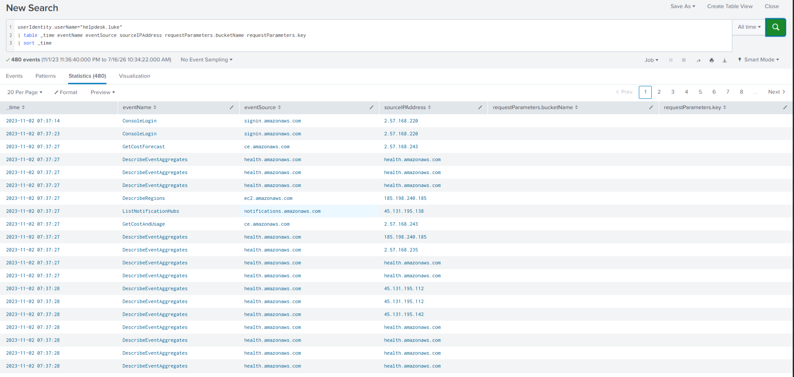
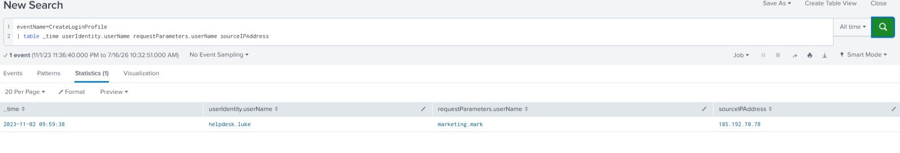
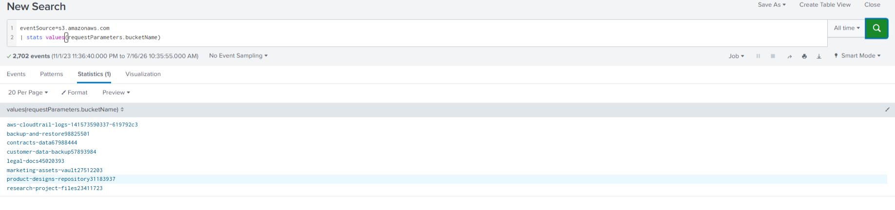
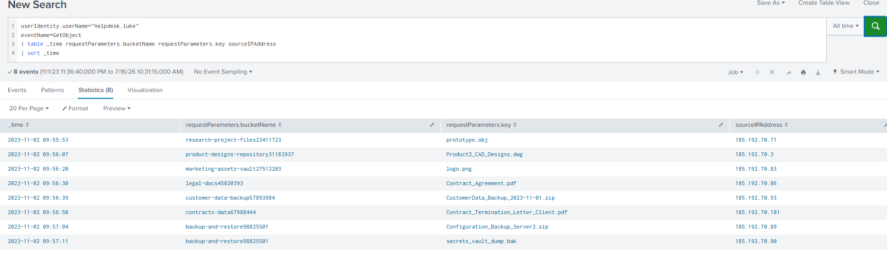
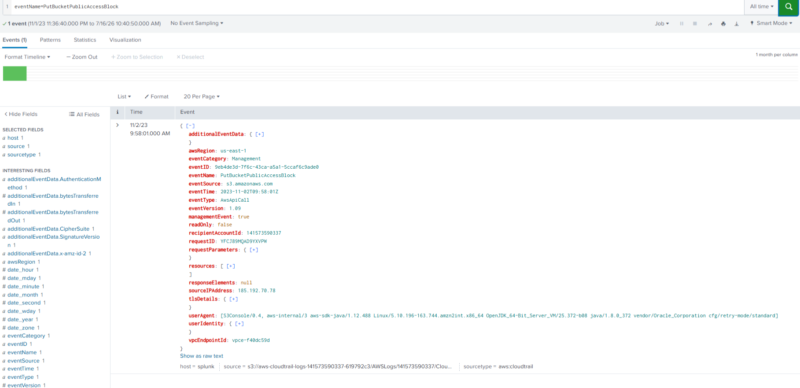
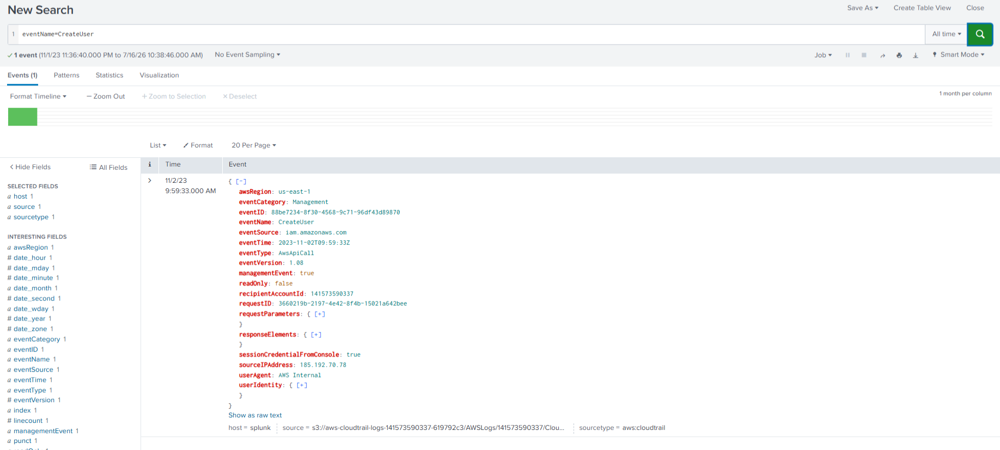
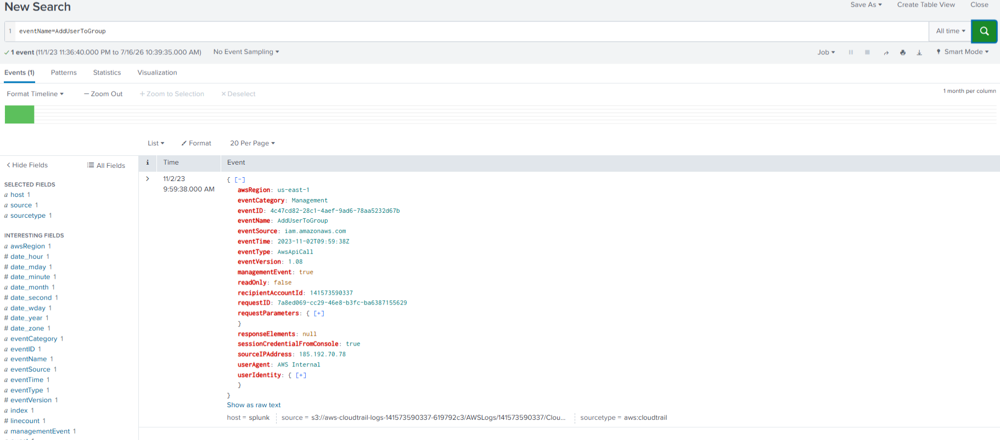
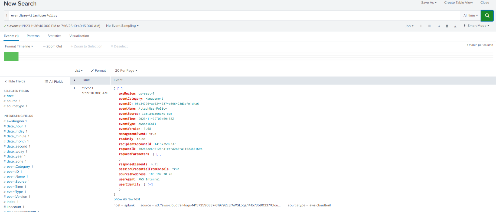

# AWS CloudTrail Investigation – Unauthorized IAM Access, S3 Data Access, and Persistence Analysis

## Investigation Overview

| Field | Value |
|-------|-------|
| **Platform** | CyberDefenders |
| **Lab Name** | AWSRaid |
| **Category** | Cloud Forensics |
| **Primary Data Source** | AWS CloudTrail |
| **Analysis Platform** | Splunk Enterprise |
| **Investigation Type** | Cloud Incident Response & Digital Forensics |
| **ATT&CK Tactics Observed** | Initial Access, Discovery, Collection, Defense Evasion, Persistence, Privilege Escalation |
| **Investigation Difficulty** | SOC Analyst L1 |

---

> **Investigation Objective:** Reconstruct the attack timeline, identify the compromised AWS IAM account, analyze attacker activity within the AWS environment, document persistence and privilege escalation techniques, and map the observed behavior to the MITRE ATT&CK framework using AWS CloudTrail logs analyzed in Splunk.

## Executive Summary

Analysis of AWS CloudTrail logs revealed that an attacker successfully authenticated to the AWS Management Console using the compromised IAM account **`helpdesk.luke`**. Following successful authentication, the attacker conducted reconnaissance to enumerate AWS resources, IAM users, groups, policies, and Amazon S3 buckets before accessing multiple objects containing business-related data.

During the intrusion, the attacker modified the security configuration of an Amazon S3 bucket, created a new IAM user (**`marketing.mark`**), configured console access for the account, and assigned administrative privileges through IAM group membership and policy assignment. These actions established a persistent, privileged backdoor within the AWS environment.

The investigation reconstructed the complete attack timeline using AWS CloudTrail logs analyzed in Splunk, identified key Indicators of Compromise (IOCs), documented attacker techniques using the MITRE ATT&CK framework, and identified detection opportunities to improve visibility into future cloud-based attacks.

---

## Investigation Scenario

The Security Operations Center (SOC) detected suspicious IAM and Amazon S3 activity within an AWS environment after abnormal management API operations were identified in AWS CloudTrail logs. The observed behavior suggested that a legitimate IAM account had been compromised and was being used to perform unauthorized administrative actions against cloud resources.

A cloud forensic investigation was initiated to determine the scope of the compromise, reconstruct the attack timeline, identify the affected AWS resources, and assess whether the attacker established persistence or elevated privileges within the environment.

The investigation was conducted using AWS CloudTrail logs ingested into Splunk, enabling correlation of authentication events, reconnaissance activity, S3 object access, cloud configuration changes, and IAM administrative operations throughout the incident.

## Investigation Objectives

The objectives of this investigation were to:

- Identify the compromised AWS IAM account used by the attacker.
- Determine the initial point of access into the AWS environment.
- Analyze post-authentication reconnaissance activities performed by the attacker.
- Identify Amazon S3 buckets and objects accessed during the intrusion.
- Detect unauthorized modifications to AWS resource configurations.
- Identify persistence mechanisms established through IAM administrative actions.
- Determine how the attacker achieved and maintained privileged access.
- Reconstruct the complete attack timeline using AWS CloudTrail logs.
- Extract and document Indicators of Compromise (IOCs) to support threat hunting and incident response.
- Map observed attacker behavior to the MITRE ATT&CK framework.
- Identify detection opportunities to improve monitoring of suspicious AWS activities and strengthen future cloud security operations.

## Investigation Methodology

The investigation followed a structured cloud forensic methodology to identify the source of the compromise, reconstruct the attack timeline, validate attacker activity, and assess the overall impact on the AWS environment. AWS CloudTrail logs were analyzed using Splunk to correlate authentication events, API activity, cloud resource access, and IAM administrative actions.

### Phase 1 – Data Familiarization

- Verified that AWS CloudTrail logs were successfully ingested into Splunk.
- Reviewed the CloudTrail event structure and available log fields.
- Identified relevant AWS services, event sources, and IAM-related activities.
- Established the scope of available forensic evidence.

### Phase 2 – Initial Access Analysis

- Analyzed AWS Management Console authentication events.
- Identified successful and failed login attempts.
- Determined the compromised IAM account.
- Established the attacker's initial point of access into the AWS environment.

### Phase 3 – Attack Reconstruction

- Reconstructed the attack chronologically using CloudTrail events.
- Investigated reconnaissance activities performed after authentication.
- Tracked Amazon S3 bucket enumeration and object access.
- Identified unauthorized modifications to cloud resource configurations.

### Phase 4 – Persistence and Privilege Escalation Analysis

- Investigated IAM administrative actions performed by the compromised account.
- Identified the creation of a new IAM user.
- Verified creation of a console login profile for the persistence account.
- Determined IAM group membership and policy assignments.
- Confirmed the attacker's persistence and privilege escalation techniques.

### Phase 5 – Evidence Correlation and Reporting

- Correlated CloudTrail events with Splunk search results to validate findings.
- Reconstructed the complete attack timeline.
- Extracted Indicators of Compromise (IOCs).
- Mapped attacker behavior to the MITRE ATT&CK framework.
- Identified detection opportunities to improve visibility into similar cloud attacks.
- Documented all findings, supporting evidence, and investigative conclusions.

## Attack Timeline

The attack timeline was reconstructed by correlating AWS CloudTrail events in chronological order using Splunk. The timeline below summarizes the attack lifecycle from the initial compromise through reconnaissance, data collection, persistence establishment, and privilege escalation.

| Time (UTC) | AWS API / Event | IAM User | Description |
|------------|-----------------|----------|-------------|
| **2023-11-02 09:37:23** | `ConsoleLogin` | `helpdesk.luke` | Successful authentication to the AWS Management Console using the compromised IAM account, marking the attacker's initial access to the environment. |
| **2023-11-02 09:37:24** | `Describe*`, `List*`, `Get*` | `helpdesk.luke` | Performed reconnaissance by enumerating AWS services, IAM users, groups, policies, regions, and Amazon S3 resources to understand the cloud environment. |
| **2023-11-02 09:55:53** | `GetObject` | `helpdesk.luke` | Accessed the first Amazon S3 object (`prototype.obj`), indicating the transition from reconnaissance to data collection. |
| **2023-11-02 09:58:01** | `PutBucketPublicAccessBlock` | `helpdesk.luke` | Modified the Public Access Block configuration of the `backup-and-restore98825501` S3 bucket, altering its security configuration. |
| **2023-11-02 09:59:33** | `CreateUser` | `helpdesk.luke` | Created a new IAM user (`marketing.mark`) to establish persistence within the AWS environment. |
| **2023-11-02 09:59:XX** | `CreateLoginProfile` | `helpdesk.luke` | Created a console login profile for `marketing.mark`, enabling interactive AWS Management Console access. |
| **2023-11-02 09:59:XX** | `AddUserToGroup` | `helpdesk.luke` | Added `marketing.mark` to the `Admins` IAM group, granting inherited administrative privileges. |
| **2023-11-02 10:00:XX** | `AttachUserPolicy` | `helpdesk.luke` | Attached IAM policies to the persistence account, reinforcing long-term privileged access within the AWS environment. |

> **Note:** The timeline was reconstructed from AWS CloudTrail management events and correlated using Splunk searches. Some timestamps have been partially masked (`XX`) and should be replaced with the exact values obtained from the corresponding CloudTrail events before publication.

### Timeline Evidence

The reconstructed attack timeline is supported by AWS CloudTrail events correlated through Splunk. The following figure illustrates the chronological sequence of attacker activities used to validate the investigation timeline.

> **Figure 1.** Reconstructed attack timeline generated from AWS CloudTrail events in Splunk.

  

**Evidence Summary**

- Confirms successful authentication using the compromised IAM account.
- Demonstrates post-authentication reconnaissance activities.
- Identifies the first Amazon S3 object accessed by the attacker.
- Shows unauthorized modification of the S3 bucket security configuration.
- Confirms creation of the persistence account (`marketing.mark`).
- Validates privilege escalation through IAM group membership and policy assignment.

## Detailed Findings

### Finding 1 – Compromised IAM User Account

#### Objective

Determine the AWS Identity and Access Management (IAM) user account that was compromised and used to perform unauthorized activities within the AWS environment.

#### Evidence

Analysis of AWS CloudTrail **`ConsoleLogin`** events identified a successful AWS Management Console authentication using the IAM account **`helpdesk.luke`**. Immediately following the successful login, the account initiated multiple reconnaissance activities and later performed several privileged IAM administrative operations.

Observed activities included:

- Successful AWS Management Console authentication
- Enumeration of AWS resources and IAM objects
- Amazon S3 bucket and object access
- Creation of a new IAM user
- Modification of IAM group membership
- Assignment of IAM policies

#### Analysis

The CloudTrail event sequence indicates that the attacker successfully authenticated using valid credentials associated with the IAM account **`helpdesk.luke`**.

Following authentication, the attacker performed systematic reconnaissance by enumerating AWS regions, IAM users, groups, policies, and Amazon S3 resources before transitioning to data collection and administrative actions. The same IAM account subsequently created a new user, configured console access, assigned administrative privileges, and attached IAM policies, demonstrating complete control over the compromised identity throughout the attack lifecycle.

The observed activity is consistent with the use of compromised valid cloud credentials to gain unauthorized access and perform post-compromise operations.

#### Conclusion

The investigation confirmed that **`helpdesk.luke`** was the compromised IAM account used by the attacker to perform reconnaissance, access cloud resources, establish persistence, and execute privileged IAM administrative actions.

#### MITRE ATT&CK

| Tactic | Technique | ATT&CK ID |
|---------|-----------|-----------|
| Initial Access | Valid Accounts | T1078 |

#### Supporting Evidence

> **Figure 2.** CloudTrail `ConsoleLogin` event confirming successful authentication using the compromised IAM account.

  

### Finding 2 – Initial Amazon S3 Object Access

#### Objective

Determine the first confirmed access to an Amazon S3 object following the compromise and assess its significance within the attack lifecycle.

#### Evidence

Analysis of AWS CloudTrail **`GetObject`** events identified multiple successful object retrievals performed by the compromised IAM account **`helpdesk.luke`**.

The first confirmed object access was:

- **Timestamp:** `2023-11-02 09:55:53 UTC`
- **API:** `GetObject`
- **Object:** `prototype.obj`

Subsequent `GetObject` events revealed access to additional business-related files, including engineering designs, contractual documents, customer backups, and other sensitive organizational data.

#### Analysis

The first successful **`GetObject`** event represents the transition from reconnaissance to data collection within the attack lifecycle.

After enumerating AWS resources and identifying available Amazon S3 buckets, the attacker began retrieving objects likely to contain valuable business information. The continued access to multiple files across different buckets indicates a deliberate effort to identify and collect sensitive organizational data.

The observed activity is consistent with cloud-based collection techniques commonly used following successful compromise of privileged cloud identities.

#### Conclusion

The investigation confirmed that the attacker's first access to an Amazon S3 object occurred at **`2023-11-02 09:55:53 UTC`**, marking the beginning of the data collection phase of the intrusion.

#### MITRE ATT&CK

| Tactic | Technique | ATT&CK ID |
|---------|-----------|-----------|
| Collection | Data from Cloud Storage Object | T1530 |

#### Supporting Evidence

> **Figure 3.** CloudTrail `GetObject` events showing the first successful access to an Amazon S3 object.

  

### Finding 3 – Access to Sensitive Amazon S3 Resources

#### Objective

Identify the Amazon S3 resources accessed by the attacker and assess the potential impact of the retrieved data.

#### Evidence

Analysis of AWS CloudTrail **`GetObject`** events confirmed that the compromised IAM account **`helpdesk.luke`** accessed multiple objects stored across Amazon S3 buckets.

Observed objects included:

- `prototype.obj`
- `Product2_CAD_Designs.dwg`
- `logo.png`
- `Contract_Agreement.pdf`
- `CustomerData_Backup_2023-11-01.zip`
- `secrets_vault_dump.bak`

The engineering design file **`Product2_CAD_Designs.dwg`** was retrieved from the following Amazon S3 bucket:

- **Bucket:** `product-designs-repository31183937`

#### Analysis

The attacker accessed a diverse set of business-related files, indicating an organized effort to identify and collect potentially valuable organizational information. The targeted data included engineering designs, contractual documents, customer backups, and application-related files, suggesting that the objective extended beyond simple reconnaissance.

The presence of engineering drawings (`.dwg`), customer backup archives (`.zip`), and database backup files (`.bak`) indicates that the attacker focused on resources that could contain intellectual property, customer information, or operational data.

The observed access pattern demonstrates systematic exploration of Amazon S3 storage rather than isolated or accidental file access.

#### Conclusion

The investigation confirmed that the attacker successfully accessed multiple sensitive Amazon S3 objects, including engineering design files stored in the **`product-designs-repository31183937`** bucket, indicating an active data collection phase following initial compromise.

#### MITRE ATT&CK

| Tactic | Technique | ATT&CK ID |
|---------|-----------|-----------|
| Collection | Data from Cloud Storage Object | T1530 |

#### Supporting Evidence

> **Figure 4.** CloudTrail `GetObject` events showing access to multiple Amazon S3 objects, including engineering design files stored in the `product-designs-repository31183937` bucket.

  

### Finding 4 – Unauthorized Modification of Amazon S3 Bucket Security Configuration

#### Objective

Determine whether the attacker modified the security configuration of any Amazon S3 bucket following the initial compromise.

#### Evidence

Analysis of AWS CloudTrail **`PutBucketPublicAccessBlock`** events identified an unauthorized modification to the Public Access Block configuration of the following Amazon S3 bucket:

- **Bucket:** `backup-and-restore98825501`

The action was performed using the compromised IAM account **`helpdesk.luke`**.

#### Analysis

The **`PutBucketPublicAccessBlock`** API is used to configure the Public Access Block settings of an Amazon S3 bucket, which help prevent unintended public exposure of bucket contents.

Modifying these settings without authorization represents a significant security concern because it can weaken existing access controls and increase the risk of sensitive data exposure.

The configuration change occurred after the attacker had successfully authenticated, completed reconnaissance activities, and accessed multiple S3 objects. This sequence indicates deliberate manipulation of cloud storage security controls as part of the overall intrusion.

#### Conclusion

The investigation confirmed that the attacker modified the Public Access Block configuration of the **`backup-and-restore98825501`** Amazon S3 bucket, resulting in an unauthorized change to the bucket's security configuration.

#### MITRE ATT&CK

| Tactic | Technique | ATT&CK ID |
|---------|-----------|-----------|
| Defense Evasion | Impair Defenses | T1562 |

#### Supporting Evidence

> **Figure 5.** CloudTrail `PutBucketPublicAccessBlock` event showing the unauthorized modification of the `backup-and-restore98825501` Amazon S3 bucket.

  

### Finding 5 – Persistence Through IAM User Creation

#### Objective

Determine whether the attacker established persistence by creating a new IAM user within the compromised AWS environment.

#### Evidence

Analysis of AWS CloudTrail **`CreateUser`** events confirmed that the compromised IAM account **`helpdesk.luke`** created the following IAM user:

- **Created User:** `marketing.mark`

The user creation occurred after the attacker had completed reconnaissance activities, accessed Amazon S3 resources, and modified cloud security configurations.

#### Analysis

The creation of a new IAM user is a well-known persistence technique in cloud environments because it provides the attacker with an alternative access path that is independent of the originally compromised account.

By creating **`marketing.mark`**, the attacker established a secondary identity capable of maintaining long-term access to the AWS environment. This reduces reliance on the compromised account and increases the likelihood of regaining access if the original credentials are detected, disabled, or reset.

The timing of the activity indicates that persistence was established only after the attacker had gained sufficient knowledge of the AWS environment and confirmed access to valuable resources.

#### Conclusion

The investigation confirmed that the attacker established persistence by creating the IAM user **`marketing.mark`**, providing an additional mechanism for maintaining unauthorized access to the AWS environment.

#### MITRE ATT&CK

| Tactic | Technique | ATT&CK ID |
|---------|-----------|-----------|
| Persistence | Account Manipulation | T1098 |

#### Supporting Evidence

> **Figure 6.** CloudTrail `CreateUser` event showing the creation of the persistence account `marketing.mark`.

  

### Finding 6 – Privilege Escalation Through IAM Group Membership

#### Objective

Determine whether the attacker elevated the privileges of the newly created IAM account by assigning it to a privileged IAM group.

#### Evidence

Analysis of AWS CloudTrail **`AddUserToGroup`** events confirmed that the compromised IAM account **`helpdesk.luke`** added the attacker-created IAM user **`marketing.mark`** to the following IAM group:

- **Group:** `Admins`

This administrative action occurred shortly after the creation of the persistence account.

#### Analysis

Adding an IAM user to a privileged IAM group is an effective privilege escalation technique because the user automatically inherits all permissions assigned to that group.

Rather than individually assigning permissions, the attacker leveraged the existing **`Admins`** group to rapidly grant administrative capabilities to the persistence account. This approach simplifies privilege management for the attacker while allowing the newly created account to operate with elevated permissions.

The close sequence of **`CreateUser`** followed by **`AddUserToGroup`** demonstrates a deliberate effort to establish a privileged persistence account capable of performing administrative operations within the AWS environment.

#### Conclusion

The investigation confirmed that the attacker elevated the privileges of the persistence account **`marketing.mark`** by adding it to the **`Admins`** IAM group, granting inherited administrative permissions within the AWS environment.

#### MITRE ATT&CK

| Tactic | Technique | ATT&CK ID |
|---------|-----------|-----------|
| Privilege Escalation | Account Manipulation | T1098 |

#### Supporting Evidence

> **Figure 7.** CloudTrail `AddUserToGroup` event showing the persistence account `marketing.mark` being added to the privileged `Admins` IAM group.

  

### Finding 7 – Administrative Permissions Assigned to the Persistence Account

#### Objective

Determine whether additional IAM permissions were assigned to the attacker-created account to strengthen persistence and administrative access.

#### Evidence

Analysis of AWS CloudTrail **`AttachUserPolicy`** events confirmed that IAM policies were attached following the creation of the persistence account.

The observed sequence of IAM administrative actions was:

1. `CreateUser`
2. `CreateLoginProfile`
3. `AddUserToGroup`
4. `AttachUserPolicy`

This sequence demonstrates a structured approach to establishing a fully functional, privileged IAM account under the attacker's control.

#### Analysis

The **`AttachUserPolicy`** API allows IAM policies to be directly associated with a user, granting additional permissions beyond those already inherited through IAM group membership.

After creating the persistence account and adding it to the privileged **`Admins`** group, the attacker further strengthened the account by attaching IAM policies. This layered approach increased the likelihood that the persistence account would retain the permissions necessary to perform administrative operations even if one privilege assignment was modified or removed.

The progression from account creation to policy assignment reflects a deliberate effort to establish durable, privileged access within the compromised AWS environment.

#### Conclusion

The investigation confirmed that the attacker attached IAM policies to the persistence account, reinforcing administrative privileges and increasing the resilience of the established persistence mechanism.

#### MITRE ATT&CK

| Tactic | Technique | ATT&CK ID |
|---------|-----------|-----------|
| Persistence | Account Manipulation | T1098 |
| Privilege Escalation | Account Manipulation | T1098 |

#### Supporting Evidence

> **Figure 8.** CloudTrail `AttachUserPolicy` event showing IAM policy assignment to the attacker-controlled persistence account.

  

## Detection Opportunities

Based on the observed attacker behavior, the following detection opportunities should be implemented to improve visibility into similar cloud-based attacks.

### Detect Suspicious AWS Console Authentication

Generate alerts for:

- Successful AWS Management Console logins from previously unseen or high-risk IP addresses.
- Multiple failed authentication attempts followed by a successful `ConsoleLogin`.
- Privileged IAM accounts authenticating without Multi-Factor Authentication (MFA).
- Successful logins originating from unusual geographic locations or outside normal business hours.

---

### Detect Cloud Reconnaissance Activity

Monitor for excessive execution of AWS reconnaissance APIs, including:

- `DescribeRegions`
- `DescribeOrganization`
- `ListUsers`
- `ListGroups`
- `ListPolicies`
- `ListBuckets`

Alert when multiple discovery-related API calls occur within a short period following authentication.

---

### Detect Suspicious Amazon S3 Activity

Generate alerts for:

- Multiple `GetObject` requests executed by a single IAM user in a short time period.
- Access to sensitive file types such as:
  - `.zip`
  - `.bak`
  - `.dwg`
  - `.pdf`
- Access to multiple Amazon S3 buckets during a single user session.

---

### Detect Unauthorized S3 Configuration Changes

Monitor high-risk S3 administrative actions, including:

- `PutBucketPublicAccessBlock`
- `PutBucketPolicy`
- `DeleteBucketPolicy`

These events may indicate attempts to weaken cloud storage security controls or expose sensitive data.

---

### Detect IAM Persistence

Generate high-severity alerts when the following IAM administrative APIs are executed:

- `CreateUser`
- `CreateLoginProfile`
- `CreateAccessKey`

These actions are commonly associated with persistence mechanisms in cloud environments.

---

### Detect Privilege Escalation

Monitor for IAM administrative events such as:

- `AddUserToGroup`
- `AttachUserPolicy`
- `AttachGroupPolicy`
- `PutUserPolicy`

Particular attention should be given to these actions when they are performed by unexpected IAM users, originate from unfamiliar source IP addresses, or occur outside approved administrative change windows.

## Indicators of Compromise (IOCs)

The following Indicators of Compromise (IOCs) were identified during the investigation. These artifacts can assist with threat hunting, retrospective log analysis, and the detection of similar activity in AWS environments.

### IAM Accounts

| Indicator | Value | Description |
|-----------|-------|-------------|
| Compromised IAM User | `helpdesk.luke` | IAM account used throughout the attack. |
| Persistence IAM User | `marketing.mark` | IAM account created by the attacker to maintain long-term access. |

---

### Network Indicators

| Indicator | Value | Description |
|-----------|-------|-------------|
| Source IP Address | `2.57.168.220` | External IP associated with successful AWS Management Console authentication. |
| Source IP Address | `185.192.70.78` | External IP associated with IAM administrative actions and persistence activities. |

---

### Amazon S3 Resources

#### Buckets

| Bucket Name | Significance |
|-------------|--------------|
| `product-designs-repository31183937` | Contained engineering design files accessed by the attacker. |
| `backup-and-restore98825501` | Bucket whose Public Access Block configuration was modified during the attack. |

#### Accessed Objects

| Object Name | Description |
|-------------|-------------|
| `prototype.obj` | First object accessed after reconnaissance. |
| `Product2_CAD_Designs.dwg` | Engineering design file. |
| `logo.png` | Application resource. |
| `Contract_Agreement.pdf` | Business contract document. |
| `CustomerData_Backup_2023-11-01.zip` | Customer backup archive. |
| `secrets_vault_dump.bak` | Database backup file. |

---

### Privileged IAM Group

| Indicator | Value | Description |
|-----------|-------|-------------|
| IAM Group | `Admins` | Privileged IAM group used to grant administrative permissions to the persistence account. |

---

# MITRE ATT&CK Mapping

The following table maps the observed attacker behavior to the MITRE ATT&CK framework based on evidence collected from AWS CloudTrail logs during the investigation.

| ATT&CK Tactic | Technique | ATT&CK ID | Evidence | Justification |
|---------------|-----------|-----------|----------|---------------|
| Initial Access | Valid Accounts | **T1078** | Successful `ConsoleLogin` using `helpdesk.luke` | The attacker authenticated using valid IAM credentials. |
| Discovery | Cloud Service Discovery | **T1526** | `DescribeRegions`, `DescribeOrganization` | The attacker enumerated AWS services and cloud resources. |
| Discovery | Permission Groups Discovery | **T1069** | `ListUsers`, `ListGroups`, `ListPolicies` | IAM users, groups, and policies were enumerated to identify privilege opportunities. |
| Collection | Data from Cloud Storage Object | **T1530** | Multiple `GetObject` events | The attacker retrieved multiple objects from Amazon S3 buckets. |
| Defense Evasion | Impair Defenses | **T1562** | `PutBucketPublicAccessBlock` | The attacker modified Amazon S3 security settings to alter cloud storage protections. |
| Persistence | Account Manipulation | **T1098** | `CreateUser`, `CreateLoginProfile` | A new IAM account was created and configured for persistent access. |
| Privilege Escalation | Account Manipulation | **T1098** | `AddUserToGroup`, `AttachUserPolicy` | Administrative privileges were assigned to the attacker-created IAM account. |

# Detection Opportunities

The investigation identified multiple opportunities to improve detection and monitoring capabilities for AWS environments. The following recommendations are based on the attacker behavior observed during this investigation and are intended to reduce attacker dwell time and improve the detection of similar cloud-based threats.

---

## Detect Suspicious AWS Console Authentication

Implement alerts for:

- Successful `ConsoleLogin` events originating from previously unseen or high-risk IP addresses.
- Multiple failed authentication attempts immediately followed by a successful login.
- Privileged IAM users authenticating without Multi-Factor Authentication (MFA).
- Successful logins occurring outside normal business hours or from unusual geographic locations.

**Priority:** High

---

## Detect Cloud Reconnaissance Activity

Monitor for excessive execution of AWS discovery-related API calls, including:

- `DescribeRegions`
- `DescribeOrganization`
- `ListUsers`
- `ListGroups`
- `ListPolicies`
- `ListBuckets`

Generate alerts when multiple reconnaissance APIs are executed within a short period following authentication.

**Priority:** Medium

---

## Detect Suspicious Amazon S3 Data Access

Generate alerts for:

- Excessive `GetObject` requests performed by a single IAM user.
- Access to multiple Amazon S3 buckets during a single user session.
- Retrieval of sensitive file types such as:
  - `.zip`
  - `.bak`
  - `.dwg`
  - `.pdf`
- Unusual download patterns from privileged IAM accounts.

**Priority:** High

---

## Detect Unauthorized Amazon S3 Configuration Changes

Monitor high-risk Amazon S3 administrative APIs, including:

- `PutBucketPublicAccessBlock`
- `PutBucketPolicy`
- `DeleteBucketPolicy`

These events should be reviewed immediately when performed by unexpected IAM users or from unfamiliar source IP addresses.

**Priority:** High

---

## Detect IAM Persistence

Generate high-severity alerts for IAM administrative actions commonly associated with persistence:

- `CreateUser`
- `CreateLoginProfile`
- `CreateAccessKey`

Alert whenever these actions are performed by users outside approved administrative roles or during unauthorized maintenance windows.

**Priority:** Critical

---

## Detect IAM Privilege Escalation

Monitor privileged IAM operations including:

- `AddUserToGroup`
- `AttachUserPolicy`
- `AttachGroupPolicy`
- `PutUserPolicy`

Generate alerts when these actions are performed on newly created IAM accounts or by users that do not normally manage IAM resources.

**Priority:** Critical

# Lessons Learned

This investigation reinforced several important concepts related to cloud forensics, AWS security monitoring, and incident response.

- AWS CloudTrail is a critical forensic data source for reconstructing attacker activity and validating cloud-based incidents.
- Chronological event correlation is essential for accurately reconstructing an attack timeline and understanding attacker behavior.
- AWS IAM administrative events provide valuable evidence for identifying persistence and privilege escalation techniques.
- Amazon S3 access logs can reveal attacker objectives by identifying the resources and data targeted during an intrusion.
- Changes to cloud security configurations should be treated as high-priority events because they can weaken security controls and increase the risk of data exposure.
- Mapping observed activity to the MITRE ATT&CK framework provides a standardized method for documenting adversary behavior and communicating findings across security teams.
- Well-documented investigative methodology, evidence correlation, and structured reporting improve the reproducibility and defensibility of forensic investigations.

---

# Conclusion

The investigation confirmed that the AWS environment was compromised through the successful use of a legitimate IAM account (**`helpdesk.luke`**). After gaining access, the attacker systematically enumerated AWS resources, accessed multiple Amazon S3 objects containing business-related data, modified the security configuration of an S3 bucket, and established a privileged persistence mechanism by creating a new IAM account (**`marketing.mark`**) and assigning administrative permissions.

By analyzing AWS CloudTrail logs in Splunk, the investigation successfully reconstructed the complete attack timeline, identified the affected AWS resources, documented Indicators of Compromise (IOCs), mapped attacker behavior to the MITRE ATT&CK framework, and identified practical detection opportunities that can improve future cloud security monitoring.

This investigation highlights the importance of continuous AWS CloudTrail monitoring, proactive IAM security controls, and timely detection of cloud administrative activities to reduce attacker dwell time and strengthen an organization's cloud security posture.

---

# Repository Contents

This repository contains the complete investigation package for the AWSRaid challenge, including the primary investigation report, supporting evidence, and analysis artifacts.

| File / Folder | Description |
|---------------|-------------|
| `README.md` | Complete cloud forensic investigation report. |
| `Evidence/Screenshots/` | Supporting screenshots collected during the investigation. |
| `Evidence/Investigation-Queries.md` | Splunk SPL queries used to perform the investigation. |
| `Evidence/Timeline-Evidence.md` | Supporting evidence used to reconstruct the attack timeline. |
| `Artifacts/Challenge-Answers.md` | Validated challenge answers. |
| `Artifacts/Indicators-of-Compromise.md` | Indicators of Compromise (IOCs) identified during the investigation. |
| `Artifacts/MITRE-ATTACK-Mapping.md` | MITRE ATT&CK mapping for the observed attacker behavior. |

---

## Acknowledgements

This investigation was completed as part of the **CyberDefenders AWSRaid** cloud forensics challenge. All findings are based on analysis of the provided AWS CloudTrail dataset and are intended for educational and professional portfolio purposes.

