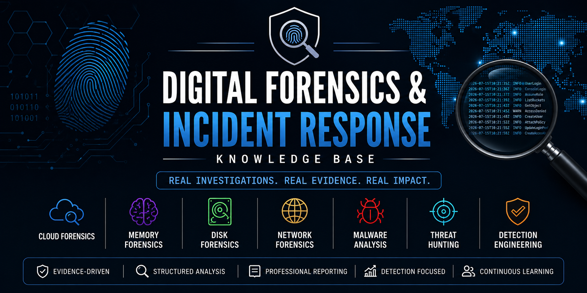

<p align="center">
  
</p>

<p align="center">


</p>

# Digital Forensics & Incident Response Knowledge Base

> A continuously growing collection of digital forensic investigations, incident response case studies, threat hunting exercises, detection engineering research, and DFIR resources documented using professional investigation methodology.

---

## About This Repository

This repository serves as a centralized Digital Forensics & Incident Response (DFIR) knowledge base, documenting hands-on investigations performed across cloud, memory, disk, network, and malware forensic scenarios.

Each investigation follows a structured methodology that emphasizes evidence collection, attack timeline reconstruction, indicator extraction, MITRE ATT&CK mapping, and detection engineering to mirror real-world incident response practices.

The primary objective of this repository is to continuously build a practical, well-documented collection of DFIR investigations while strengthening technical skills through repeatable analysis and professional reporting.

---

---

## Table of Contents

- [About This Repository](#about-this-repository)
- [Investigation Domains](#investigation-domains)
- [Repository Structure](#repository-structure)
- [Investigation Categories](#investigation-categories)
- [Investigation Methodology](#investigation-methodology)
- [Investigation Standards](#investigation-standards)
- [Investigation Index](#investigation-index)
- [Tools & Technologies](#tools--technologies)
- [Objectives](#objectives)
- [Repository Statistics](#repository-statistics)
- [Certifications & Continuous Learning](#certifications--continuous-learning)
- [Connect With Me](#connect-with-me)

---

# Quick Navigation

## ☁️ Cloud Forensics

| Investigation | Status |
|---------------|:------:|
| [AWSRaid](Cloud-Forensics/AWSRaid/) | ✅ |

---

## 🧠 Memory Forensics

| Investigation | Status |
|---------------|:------:|
| *Coming Soon* | ⏳ |

---

## 💽 Disk Forensics

| Investigation | Status |
|---------------|:------:|
| *Coming Soon* | ⏳ |

---

## 🌐 Network Forensics

| Investigation | Status |
|---------------|:------:|
| *Coming Soon* | ⏳ |

---

## 🦠 Malware Analysis

| Investigation | Status |
|---------------|:------:|
| *Coming Soon* | ⏳ |

---

## 🎯 Threat Hunting

| Investigation | Status |
|---------------|:------:|
| *Coming Soon* | ⏳ |

---

## 🛡️ Detection Engineering

| Investigation | Status |
|---------------|:------:|
| *Coming Soon* | ⏳ |

---

## 📖 Incident Response Playbooks

| Playbook | Status |
|----------|:------:|
| *Coming Soon* | ⏳ |

---

## 📚 Resources

| Resource | Status |
|----------|:------:|
| *Coming Soon* | ⏳ |

## Investigation Domains

This knowledge base is organized into the following Digital Forensics & Incident Response domains:

- ☁️ Cloud Forensics
- 🧠 Memory Forensics
- 💽 Disk Forensics
- 🌐 Network Forensics
- 🦠 Malware Analysis
- 🎯 Threat Hunting
- 🛡️ Detection Engineering
- 📖 Incident Response Playbooks
- 📚 DFIR Resources

---

## Repository Structure

```text
DFIR-Portfolio/
│
├── Cloud-Forensics/
├── Memory-Forensics/
├── Disk-Forensics/
├── Network-Forensics/
├── Malware-Analysis/
├── Threat-Hunting/
├── Detection-Engineering/
├── Incident-Response-Playbooks/
└── Resources/
```

---

## Investigation Categories

| Domain | Investigations |
|--------|----------------|
| ☁️ Cloud Forensics | AWS CloudTrail, Azure, Microsoft 365, IAM, Cloud Security |
| 🧠 Memory Forensics | Volatility, Windows Memory Analysis, Malware Memory Analysis |
| 💽 Disk Forensics | NTFS, MFT, USN Journal, Browser Artifacts, File System Analysis |
| 🌐 Network Forensics | PCAP Analysis, HTTP, DNS, SMB, Network Intrusion Analysis |
| 🦠 Malware Analysis | Static Analysis, Dynamic Analysis, Malware Behavior |
| 🎯 Threat Hunting | Windows Event Logs, Sysmon, Sigma, IOC Hunting |
| 🛡️ Detection Engineering | Splunk, KQL, Sigma Rules, Detection Logic |
| 📖 Incident Response Playbooks | Investigation Methodologies, Triage Guides, Response Procedures |
| 📚 DFIR Resources | Notes, Cheat Sheets, Reference Material, Tool Guides |

---

## Investigation Methodology

Every investigation within this knowledge base follows a consistent forensic workflow to ensure structured analysis, reproducibility, and professional documentation.

1. Evidence Acquisition
2. Data Familiarization
3. Investigation Planning
4. Artifact Analysis
5. Attack Timeline Reconstruction
6. Indicators of Compromise (IOC) Identification
7. MITRE ATT&CK Mapping
8. Detection Opportunity Identification
9. Documentation & Reporting

---

## Investigation Standards

Every investigation contained within this knowledge base follows a standardized reporting structure.

- Executive Summary
- Investigation Scenario
- Investigation Objectives
- Investigation Methodology
- Attack Timeline
- Timeline Evidence
- Detailed Findings
- Indicators of Compromise (IOCs)
- MITRE ATT&CK Mapping
- Detection Opportunities
- Lessons Learned
- Conclusion
- Supporting Evidence

---

## Investigation Index

### ☁️ Cloud Forensics

| Investigation | Status |
|---------------|--------|
| AWSRaid | ✅ Completed |

---

### 🧠 Memory Forensics

| Investigation | Status |
|---------------|--------|
| Coming Soon | ⏳ Planned |

---

### 💽 Disk Forensics

| Investigation | Status |
|---------------|--------|
| Coming Soon | ⏳ Planned |

---

### 🌐 Network Forensics

| Investigation | Status |
|---------------|--------|
| Coming Soon | ⏳ Planned |

---

### 🦠 Malware Analysis

| Investigation | Status |
|---------------|--------|
| Coming Soon | ⏳ Planned |

---

### 🎯 Threat Hunting

| Investigation | Status |
|---------------|--------|
| Coming Soon | ⏳ Planned |

---

### 🛡️ Detection Engineering

| Investigation | Status |
|---------------|--------|
| Coming Soon | ⏳ Planned |

---

### 📖 Incident Response Playbooks

| Investigation | Status |
|---------------|--------|
| Coming Soon | ⏳ Planned |

---

### 📚 Resources

| Resource | Status |
|----------|--------|
| Coming Soon | ⏳ Planned |

---

## Tools & Technologies

The investigations within this knowledge base utilize industry-standard digital forensics, incident response, cloud security, and threat hunting tools.

| Category | Tools |
|----------|-------|
| SIEM | Splunk, Microsoft Sentinel |
| Cloud | AWS CloudTrail, IAM, Amazon S3 |
| Memory Forensics | Volatility 3 |
| Disk Forensics | Autopsy, FTK Imager |
| Network Forensics | Wireshark |
| Detection Engineering | Sigma, KQL, SPL |
| Threat Intelligence | MITRE ATT&CK, VirusTotal |
| Supporting Tools | CyberChef, CyberDefenders |

---

## Objectives

The objectives of this knowledge base are to:

- Document structured Digital Forensics & Incident Response (DFIR) investigations.
- Build practical experience across multiple forensic disciplines.
- Develop repeatable investigation methodologies.
- Practice evidence-based incident analysis and reporting.
- Create a reference library for DFIR techniques, tools, and workflows.
- Strengthen detection engineering and threat hunting capabilities.
- Continuously expand technical knowledge through hands-on investigations.

---

## Repository Statistics

| Metric | Count |
|--------|------:|
| Total Investigations | 1 |
| Cloud Forensics | 1 |
| Memory Forensics | 0 |
| Disk Forensics | 0 |
| Network Forensics | 0 |
| Malware Analysis | 0 |
| Threat Hunting | 0 |
| Detection Engineering Projects | 0 |
| Incident Response Playbooks | 0 |
| Indicators of Compromise Documented | 6 |
| MITRE ATT&CK Techniques Mapped | 7 |
| Attack Timelines Reconstructed | 1 |
| Splunk Queries Written | 11 |

---

## Certifications & Continuous Learning

This knowledge base is continuously updated as new investigations are completed and additional skills are developed through hands-on practice, research, and professional training.

### Current Certifications

- Certified AppSec Practitioner (CAP)
> **Currently preparing for the SANS FOR508: Advanced Incident Response, Threat Hunting, and Digital Forensics certification through structured hands-on investigations and continuous practical learning.**

### Current Learning Focus

- Digital Forensics & Incident Response (DFIR)
- Cloud Forensics
- Memory Forensics
- Disk Forensics
- Network Forensics
- Threat Hunting
- Detection Engineering

---

## Connect With Me

- **LinkedIn:** *Coming Soon*
- **Email:** rrishabhcchaauhan@gmail.com

---

---

## Featured Investigation

The investigation below represents the current featured case study within this knowledge base.

| Investigation | Domain | Status |
|---------------|--------|--------|
| **AWS CloudTrail Investigation – Unauthorized IAM Access, S3 Data Access, and Persistence Analysis** | Cloud Forensics | ✅ Completed |

### Investigation Highlights

- End-to-end cloud forensic investigation using AWS CloudTrail logs.
- Incident reconstruction using Splunk Search Processing Language (SPL).
- Identification of compromised IAM credentials.
- Reconstruction of the complete attacker timeline.
- Investigation of Amazon S3 data access and cloud resource enumeration.
- Detection of unauthorized security configuration changes.
- Analysis of persistence and privilege escalation techniques.
- Extraction of Indicators of Compromise (IOCs).
- MITRE ATT&CK mapping of observed adversary behavior.
- Detection engineering recommendations based on investigation findings.

📂 **Investigation Location:** `Cloud-Forensics/AWSRaid`

---

## Skills Demonstrated

The investigations within this knowledge base demonstrate practical experience across the following cybersecurity disciplines:

### Digital Forensics & Incident Response (DFIR)

- Incident Investigation
- Evidence Collection & Analysis
- Attack Timeline Reconstruction
- Indicators of Compromise (IOC) Identification
- Root Cause Analysis
- Incident Documentation

### Cloud Security

- AWS CloudTrail Analysis
- IAM Investigation
- Amazon S3 Security Analysis
- Cloud Configuration Review
- Cloud Threat Detection

### Threat Hunting & Detection Engineering

- Splunk SPL
- Log Analysis
- Threat Hunting
- MITRE ATT&CK Mapping
- Detection Opportunity Identification

### Network & System Analysis

- Authentication Analysis
- Windows Event Analysis
- Network Artifact Analysis
- Security Log Investigation

### Reporting & Documentation

- Executive Reporting
- Technical Investigation Reports
- Evidence Documentation
- Professional DFIR Case Studies


---

## Knowledge Base Roadmap

This knowledge base is being continuously expanded across multiple Digital Forensics & Incident Response (DFIR) domains.

| Domain | Progress |
|---------|:--------:|
| ☁️ Cloud Forensics | 🟩 1 Investigation |
| 🧠 Memory Forensics | ⏳ Planned |
| 💽 Disk Forensics | ⏳ Planned |
| 🌐 Network Forensics | ⏳ Planned |
| 🦠 Malware Analysis | ⏳ Planned |
| 🎯 Threat Hunting | ⏳ Planned |
| 🛡️ Detection Engineering | ⏳ Planned |
| 📖 Incident Response Playbooks | ⏳ Planned |
| 📚 DFIR Resources | ⏳ Planned |

---

## Investigation Workflow

Every investigation documented within this knowledge base follows a consistent workflow to ensure structured analysis and professional reporting.

```text
Incident Detection
        │
        ▼
Evidence Collection
        │
        ▼
Data Familiarization
        │
        ▼
Artifact Analysis
        │
        ▼
Timeline Reconstruction
        │
        ▼
IOC Identification
        │
        ▼
MITRE ATT&CK Mapping
        │
        ▼
Detection Opportunities
        │
        ▼
Investigation Report
```

---

## Investigation Lifecycle

Each investigation progresses through the following lifecycle before being added to this knowledge base.

| Stage | Description |
|--------|-------------|
| 📥 Data Acquisition | Collect logs, memory images, disk images, PCAPs, or other forensic artifacts. |
| 🔍 Investigation | Analyze evidence using appropriate forensic methodologies and tools. |
| 🧩 Correlation | Correlate events, artifacts, and attacker activity to reconstruct the incident. |
| 📄 Documentation | Document findings, evidence, timelines, and analysis. |
| 🎯 MITRE Mapping | Map observed attacker behavior to the MITRE ATT&CK framework. |
| 🛡️ Detection Engineering | Identify detection opportunities and defensive improvements. |
| 📚 Publication | Publish the completed investigation to the knowledge base. |

---

## Repository Principles

This knowledge base is maintained using the following principles:

- Evidence-driven investigations.
- Standardized investigation methodology.
- Reproducible analysis.
- Professional technical documentation.
- MITRE ATT&CK aligned reporting.
- Practical detection engineering recommendations.
- Continuous learning through hands-on investigations.
- Consistent repository structure across all investigations.